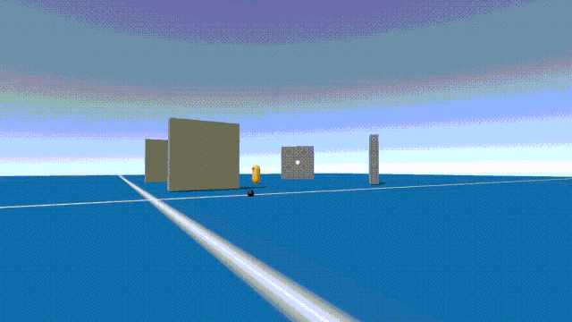
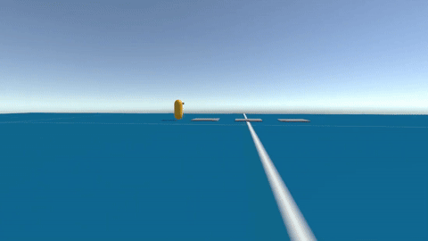
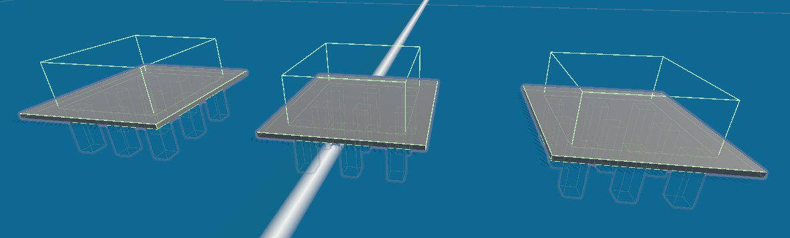
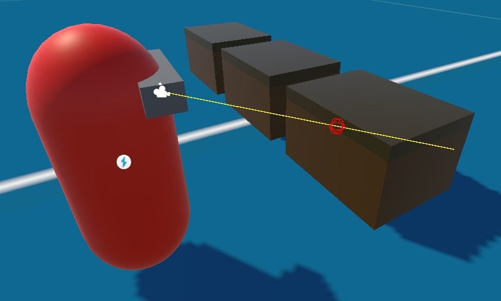

## Progress Report for November 10

Although the main components are still under development, we are excited to introduce several secondary features and mechanics, we've managed to finish this week.

These features are essential components for building a level, representing the various objects that will populate the environment, but the functionalities attached to them cover additional aspects of the game, such as looting and AI encounters.

### Spell Crafting


 
The player is able to enter the spell menu, choose the spell type: attack, defense. And the spell element: Fire, Air, Water, Earth. Then the player can use the spell that he crafted. This system is using the new input system.

### Spike Traps



In order to make the environment more entertaining we've inroduced the spike trap mechanic. It functions by detecting all colliders that enter a designated area above it, specifically targeting a designated trigger component.



If the list tracking all the triggering entities in this area is not empty, the trap executes a coroutine that shoots and retracts each spike by adjusting its Y coordinates, while also triggering a damage-dealing event.

### Interactions & Chests

In the game, players will encounter various objects that require holding down a specific button to activate an effect. A basic example is opening a chest to collect gold. By implementing this functionality with a suitable level of abstraction, we can create a universally configurable interaction system.


The two primary abstractions involved are the Interactor class and the IInteractable interface. The IInteractable interface is straightforward—it’s implemented by objects the player can interact with and defines the core interaction methods.

```C#
interface IInteractable
{
    public bool CheckInteraction();
    public bool Interact();
    public void CallInteractionHint();
}
```

The Interactor uses raycasting to check if one of those methods need to be called.



The raycast check that triggers the key hint overlay when approaching an interactable object runs a few times per second within a coroutine, while the actual interaction raycast occurs only when the highlighted key is pressed.

The object the player interacts with "accumulates" consecutive interaction calls over a specified duration required to complete the interaction.

Once the required amount is accumulated, an event is triggered and returned to the player.

### Spawners

Lastly, there’s the spawning mechanic. The main idea is straightforward: to continuously (configurable) spawn new instances of specified enemies at intervals of n seconds, as long as no similar instances exist within a range of m.


Upon instantiation, it is possible to set all the key characteristics for the created agents, such as patrol path length, attack and detection radius, and other relevant parameters.