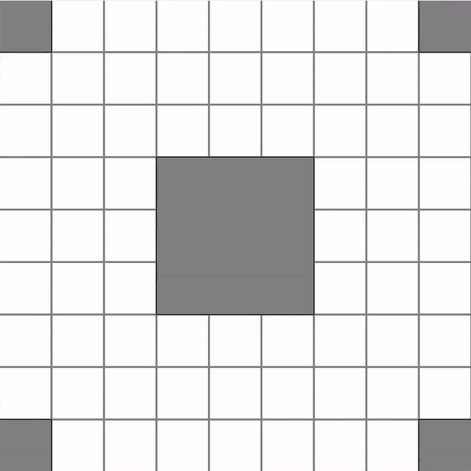

## Progress Report for November 10

Last week we mostly talked about the implementation of all the minor components, this week we are ready to present the first versions of the combat system and level generation.

### Level Generation

The task was set as follows: fill a grid of odd length multiple of three, as follows:

1. Place 1x1 rooms in the corners of the grid to serve as player spawn points
2. Position a 3x3 room at the center of the grid as the treasure room
3. Add N 3x1 rooms in both vertical and horizontal orientations, ensuring no overlaps
4. Fill any remaining spaces with 1x1 rooms

The generator code is supposed to return a list of rooms in form of a tuple (x_size, y_size, x_pos, y_pos, orientation).

From the 4 steps listed, the third step is the only one that can be challenging. Essentially, it is handled recursively: the algorithm attempts to place a room in a random position and orientation within the grid, making up to 32 attempts while checking for overlaps. If a room cannot be placed, the algorithm repositions the previous room and tries again.

After generating the list of rooms, we can iterate through it, instantiating, placing, and rotating the different room prefabs as specified.

### Prefabs